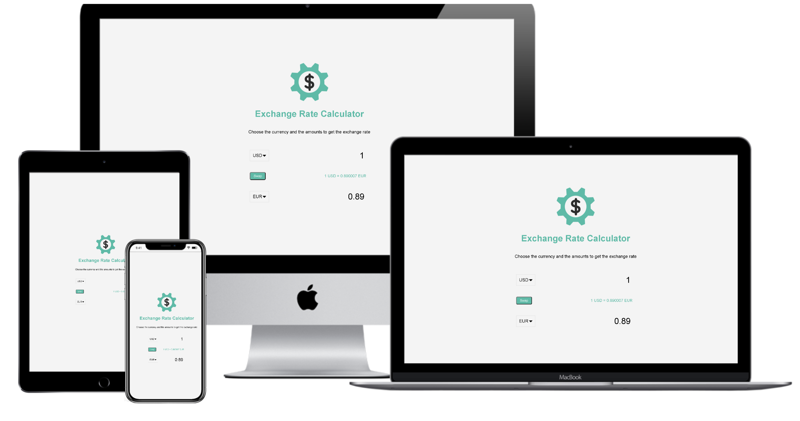

<h1 align="center">
 
  
   
     
  JavaScript - Fetch API
   
</h1>

<h3 align="center">Interactive Front End Development</h3>

## Exchange Rate Calculator

Select countries to get the exchange rate for a specific amount

## Project Specifications

- Display UI with 2 select lists for countries and 2 inputs for amounts
- Fetch exchange rates from API (https://api.exchangerate-api.com)
- Display the values for both countries
- Update values on amount change
- Swap country rates
